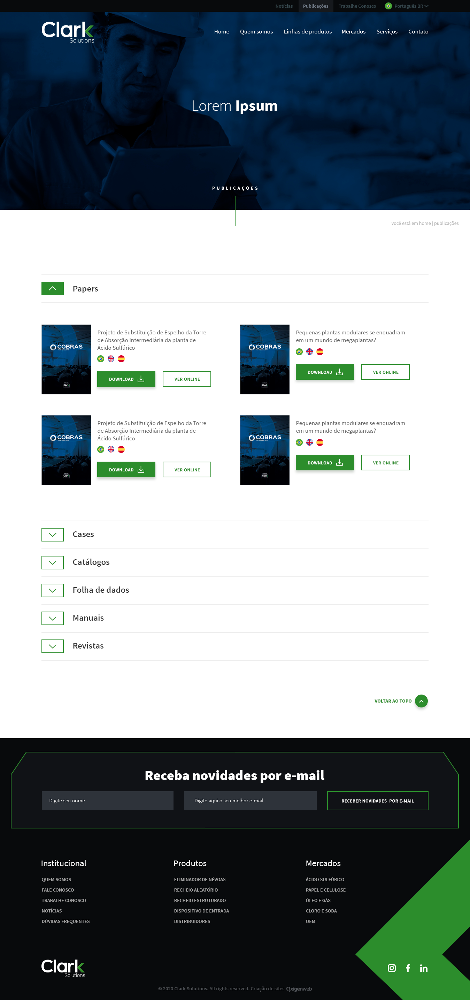

# Desafio-Front-end-Clark-Solutions

Desafio para vaga de front-end

## Recursos

* O Desafio foi feito usando CSS, HTML, JavaScript e BootStrap.

## Uso

1. Clone o repositório do GitHub.
2. Abra o projeto no seu editor de código.
3. Abra o arquivo index.html (Página estática).

## Créditos

Este projeto foi criado por Alaska Websites.
